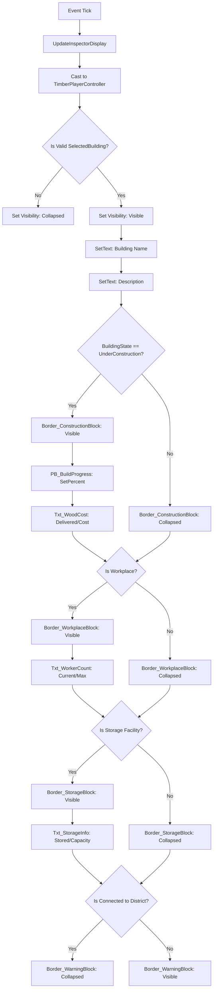

# 📋 TÀI LIỆU KỸ THUẬT BLUEPRINT GRAPH: WBP_BUILDINGINSPECTOR

> **Mục đích tài liệu**: Lưu trữ vĩnh viễn toàn bộ cấu trúc đồ thị Blueprint Graph, phân cấp Component, các cổng kết nối (Pins), kiểu dữ liệu (Data Types), Biến số và Hàm số của Widget **`WBP_BuildingInspector`** để tra cứu, bảo trì và tái sử dụng cho mọi công trình trong game.

---

## 🎨 1. CÂY PHÂN CẤP GIAO DIỆN (DESIGNER HIERARCHY)

```text
[Canvas Panel]
└── Border_Main (Slot: Top-Left, Pos: (30, 120), SizeX: 340, SizeToContent: True, Color: #141E18F0)
    └── VB_Content (Vertical Box)
        ├── HB_Header (Horizontal Box)
        │   ├── Txt_BuildingName (Text, IsVariable: True, Fill: 1.0, Font: Bold 18, Color: #F0E6D2)
        │   └── Btn_Close (Button, IsVariable: True, Auto, Tint: #8A2B2B)
        │       └── Text: "X" (Font: Bold 12, Color: #FFFFFF)
        ├── Txt_Description (Text, IsVariable: True, Font: Regular 11, Color: #B0B0B0, AutoWrap: True)
        ├── Border_ConstructionBlock (Border, IsVariable: True, Color: #1B2620F0)
        │   └── VerticalBox
        │       ├── Text: "Construction Site" (Font: Bold 13, Color: #C5E1A5)
        │       ├── PB_BuildProgress (Progress Bar, IsVariable: True, FillColor: #F4D03F)
        │       └── Txt_WoodCost (Text, IsVariable: True, Text: "Wood: 0 / 10", Color: #FAF0CA)
        ├── Border_WorkplaceBlock (Border, IsVariable: True, Color: #1B2E24F0)
        │   └── VB_WorkplaceInner (Vertical Box)
        │       ├── Text: "Workplace" (Font: Bold 13, Color: #4ECCA3)
        │       └── HB_WorkerControls (Horizontal Box)
        │           ├── Txt_WorkerCount (Text, IsVariable: True, Text: "Workers: 0 / 1", Fill: 1.0)
        │           ├── Btn_RemoveWorker (Button, IsVariable: True, Tint: #2C3E35) -> Text: "-"
        │           └── Btn_AddWorker (Button, IsVariable: True, Tint: #1B6B50) -> Text: "+"
        ├── Border_StorageBlock (Border, IsVariable: True, Color: #2A2218F0)
        │   └── VB_StorageInner (Vertical Box)
        │       ├── Text: "Storage" (Font: Bold 13, Color: #F4A261)
        │       └── Txt_StorageInfo (Text, IsVariable: True, Text: "Wood: 20 / 50", Color: #FAF0CA)
        └── Border_WarningBlock (Border, IsVariable: True, Color: #4A1212F0)
            └── Text: "⛔ It is too far from a district and cannot be reached. Build more paths!" (AutoWrap: True)
```

---

## 🧠 2. CHI TIẾT ĐỒ THỊ HÀM: `UpdateInspectorDisplay`

Hàm này được gọi mỗi khung hình từ `Event Tick` để đồng bộ dữ liệu thời gian thực giữa C++ và UI.

### 📌 Nhánh 1: Lấy Căn Bản & Kiểm Tra Tính Hợp Lệ (Base Validation)
* **Node 1**: `UpdateInspectorDisplay` (Function Entry Point).
  - *Exec Out* $\rightarrow$ Nối vào *Exec In* của **Node 3**.
* **Node 2**: `Get Player Controller` (Player Index = 0).
  - *Return Value (Blue)* $\rightarrow$ Nối vào *Object (Blue)* của **Node 3**.
* **Node 3**: `Cast To TimberPlayerController`.
  - *Exec Out* $\rightarrow$ Nối vào *Exec In* của **Node 5**.
  - *As Timber Player Controller (Blue)* $\rightarrow$ Nối vào *Target (Blue)* của **Node 4**.
* **Node 4**: `Get Selected Building Actor` (Target: TimberPlayerController).
  - *Selected Building Actor (Blue)* $\rightarrow$ Nối vào *Input Object (Blue)* của **Node 5**.
* **Node 5**: `Is Valid` (Macro kiểm tra Object có hợp lệ không).
  - *Exec Is Not Valid (White)* $\rightarrow$ Nối vào *Exec In* của **Node 6**.
  - *Exec Is Valid (White)* $\rightarrow$ Nối vào *Exec In* của **Node 7** (Bắt đầu Nhánh 2).
* **Node 6**: `Set Visibility` (Target: Self).
  - *In Visibility*: `Collapsed` (Ẩn bảng khi không có công trình nào được chọn).

---

### 🏷️ Nhánh 2: Gán Tên Công Trình & Dòng Mô Tả (Header & Description)
* **Node 7**: `Set Visibility` (Target: Self).
  - *In Visibility*: `Visible` (Hiện bảng lên khi công trình hợp lệ).
  - *Exec Out* $\rightarrow$ Nối vào *Exec In* của **Node 9**.
* **Node 8**: `Get Building Name` (Target: Selected Building Actor).
  - *Building Name (String/Pink)* $\rightarrow$ Nối vào *In Text (Pink)* của **Node 9** (qua node trung gian `To Text (String)`).
* **Node 9**: `SetText (Text)` (Target: `Txt_BuildingName`).
  - *Exec Out* $\rightarrow$ Nối vào *Exec In* của **Node 11**.
* **Node 10**: `Get Building Description` (Target: Selected Building Actor).
  - *Building Description (String/Pink)* $\rightarrow$ Nối vào *In Text (Pink)* của **Node 11** (qua node trung gian `To Text (String)`).
* **Node 11**: `SetText (Text)` (Target: `Txt_Description`).
  - *Exec Out* $\rightarrow$ Nối vào *Exec In* của **Node 14** (Bắt đầu Nhánh 3).

---

### 🔨 Nhánh 3: Khối Tiến Độ Thi Công (`Border_ConstructionBlock`)
* **Node 12**: `Get Building State` (Target: Selected Building Actor).
  - *Building State (Byte Enum)* $\rightarrow$ Nối vào *A* của **Node 13**.
* **Node 13**: `Equal (Enum)` (`==`).
  - *B*: `UnderConstruction` (Scaffold).
  - *Return Value (Red)* $\rightarrow$ Nối vào *Condition (Red)* của **Node 14**.
* **Node 14**: `Branch` (Rẽ nhánh điều kiện).
  - *Exec True* $\rightarrow$ Nối vào *Exec In* của **Node 15**.
  - *Exec False* $\rightarrow$ Nối vào *Exec In* của **Node 19**.
* **Node 15**: `Set Visibility` (Target: `Border_ConstructionBlock`).
  - *In Visibility*: `Visible`.
  - *Exec Out* $\rightarrow$ Nối vào *Exec In* của **Node 17**.
* **Node 16**: `Get Current Build Progress` / `Get Build Progress Percent` (Target: Selected Building Actor).
  - *Return Value (Green Float)* $\rightarrow$ Nối vào *In Percent (Green Float)* của **Node 17**.
* **Node 17**: `Set Percent` (Target: `PB_BuildProgress`).
  - *Exec Out* $\rightarrow$ Nối vào *Exec In* của **Node 18**.
* **Node 18**: `SetText (Text)` (Target: `Txt_WoodCost`).
  - *In Text* $\leftarrow$ Lấy từ chân *Result* của node `Format Text` (`Wood: {Delivered} / {Cost}`).
    - `{Delivered}` $\leftarrow$ `Get Current Wood Delivered` (Selected Building Actor).
    - `{Cost}` $\leftarrow$ `Get Wood Cost` (Selected Building Actor).
  - *Exec Out* $\rightarrow$ Nối vào *Exec In* của **Node 21** (Bắt đầu Nhánh 4).
* **Node 19**: `Set Visibility` (Target: `Border_ConstructionBlock`).
  - *In Visibility*: `Collapsed`.
  - *Exec Out* $\rightarrow$ Nối vào *Exec In* của **Node 21** (Bắt đầu Nhánh 4).

---

### 💼 Nhánh 4: Khối Nơi Làm Việc (`Border_WorkplaceBlock`)
* **Node 20**: `Is Workplace` (Target: Selected Building Actor).
  - *Return Value (Red Bool)* $\rightarrow$ Nối vào *Condition (Red)* của **Node 21**.
* **Node 21**: `Branch` (Rẽ nhánh).
  - *Exec In*: Nhận đồng thời 2 luồng dây từ **Node 18** và **Node 19**.
  - *Exec True* $\rightarrow$ Nối vào *Exec In* của **Node 22**.
  - *Exec False* $\rightarrow$ Nối vào *Exec In* của **Node 25**.
* **Node 22**: `Set Visibility` (Target: `Border_WorkplaceBlock`).
  - *In Visibility*: `Visible`.
  - *Exec Out* $\rightarrow$ Nối vào *Exec In* của **Node 24**.
* **Node 23**: `Format Text` (Format: `Workers: {Current} / {Max}`).
  - `{Current}` $\leftarrow$ `Get Current Workers` (Selected Building Actor).
  - `{Max}` $\leftarrow$ `Get Max Workers` (Selected Building Actor).
* **Node 24**: `SetText (Text)` (Target: `Txt_WorkerCount`).
  - *In Text* $\leftarrow$ Nối từ chân *Result* của **Node 23**.
  - *Exec Out* $\rightarrow$ Nối vào *Exec In* của **Node 27** (Bắt đầu Nhánh 5).
* **Node 25**: `Set Visibility` (Target: `Border_WorkplaceBlock`).
  - *In Visibility*: `Collapsed`.
  - *Exec Out* $\rightarrow$ Nối vào *Exec In* của **Node 27** (Bắt đầu Nhánh 5).

---

### 📦 & ⛔ Nhánh 5: Khối Kho Chứa & Khối Cảnh Báo Mất Đường
#### Phần A: Khối Kho Chứa (`Border_StorageBlock`)
* **Node 26**: `Is Storage Facility` (Target: Selected Building Actor).
  - *Return Value (Red Bool)* $\rightarrow$ Nối vào *Condition (Red)* của **Node 27**.
* **Node 27**: `Branch`.
  - *Exec In*: Nhận 2 luồng dây từ **Node 24** và **Node 25**.
  - *Exec True* $\rightarrow$ Nối vào *Exec In* của **Node 28**.
  - *Exec False* $\rightarrow$ Nối vào *Exec In* của **Node 31**.
* **Node 28**: `Set Visibility` (Target: `Border_StorageBlock`).
  - *In Visibility*: `Visible`.
  - *Exec Out* $\rightarrow$ Nối vào *Exec In* của **Node 30**.
* **Node 29**: `Format Text` (Format: `Wood: {Current} / {Max}`).
  - `{Current}` $\leftarrow$ `Get Current Stored Amount` (Selected Building Actor).
  - `{Max}` $\leftarrow$ `Get Max Storage Capacity` (Selected Building Actor).
* **Node 30**: `SetText (Text)` (Target: `Txt_StorageInfo`).
  - *In Text* $\leftarrow$ Nối từ chân *Result* của **Node 29**.
  - *Exec Out* $\rightarrow$ Nối vào *Exec In* của **Node 33** (Khối cảnh báo đỏ).
* **Node 31**: `Set Visibility` (Target: `Border_StorageBlock`).
  - *In Visibility*: `Collapsed`.
  - *Exec Out* $\rightarrow$ Nối vào *Exec In* của **Node 33** (Khối cảnh báo đỏ).

#### Phần B: Khối Cảnh Báo Mất Đường (`Border_WarningBlock`)
* **Node 32**: `Get Is Connected to District` (Target: Selected Building Actor).
  - *Return Value (Red Bool)* $\rightarrow$ Nối vào *Condition (Red)* của **Node 33**.
* **Node 33**: `Branch`.
  - *Exec In*: Nhận 2 luồng dây từ **Node 30** và **Node 31**.
  - *Exec True (Đã nối đường tốt)* $\rightarrow$ Nối vào *Exec In* của **Node 34**.
  - *Exec False (Bị đứt đường)* $\rightarrow$ Nối vào *Exec In* của **Node 35**.
* **Node 34**: `Set Visibility` (Target: `Border_WarningBlock`).
  - *In Visibility*: `Collapsed` (Ẩn banner đỏ khi có đường).
* **Node 35**: `Set Visibility` (Target: `Border_WarningBlock`).
  - *In Visibility*: `Visible` (Hiện banner đỏ cảnh báo người chơi lát thêm đường).

---

## 🖱️ 3. CHI TIẾT SỰ KIỆN TRONG `EventGraph`

### 1. Vòng lặp cập nhật liên tục:
```text
[ Event Tick ] ──► [ UpdateInspectorDisplay ]
```

### 2. Nút Tuyển Thợ (`Btn_AddWorker`):
```text
[ On Clicked (Btn_AddWorker) ] ──► [ Cast To TimberPlayerController ] ──► [ Add Worker to Selected Building ]
                                          ▲ (Object)                                ▲ (Target)
[ Get Player Controller (0) ] ────────────┘─────────────────────────────────────────┘
```

### 3. Nút Cho Thôi Việc (`Btn_RemoveWorker`):
```text
[ On Clicked (Btn_RemoveWorker) ] ──► [ Cast To TimberPlayerController ] ──► [ Remove Worker from Selected Building ]
                                             ▲ (Object)                                   ▲ (Target)
[ Get Player Controller (0) ] ───────────────┘────────────────────────────────────────────┘
```

### 4. Nút Đóng Bảng (`Btn_Close`):
```text
[ On Clicked (Btn_Close) ] ──► [ Cast To TimberPlayerController ] ──► [ Deselect Building ]
                                      ▲ (Object)                               ▲ (Target)
[ Get Player Controller (0) ] ────────┘────────────────────────────────────────┘
```

---

## 📊 4. SƠ ĐỒ TOÀN CẢNH LUỒNG DỮ LIỆU (DATA FLOW MERMAID)


